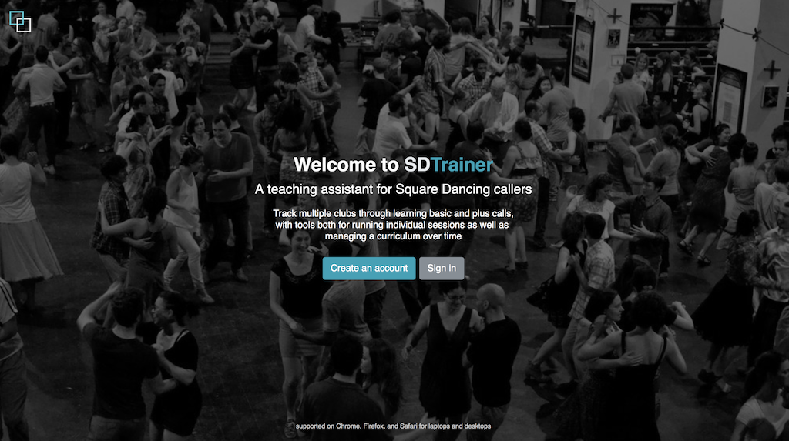
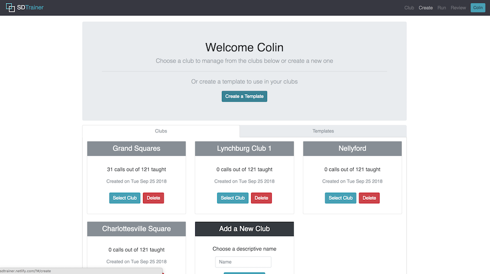
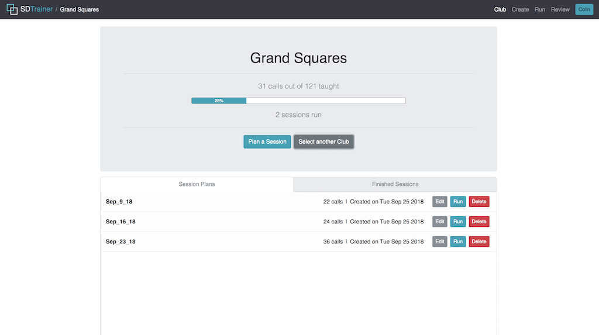
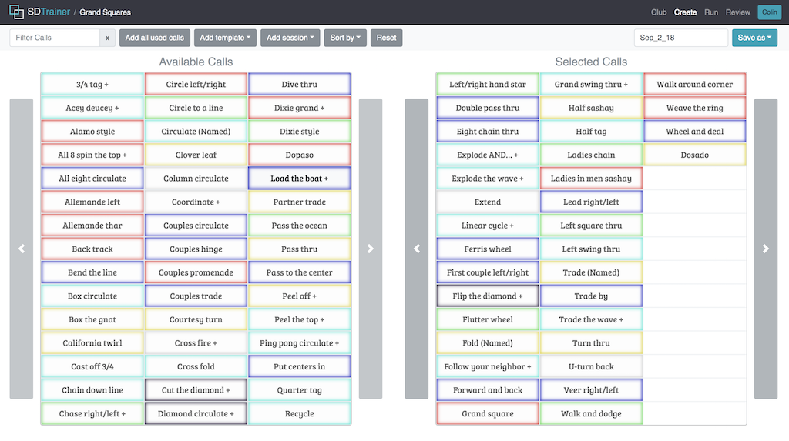
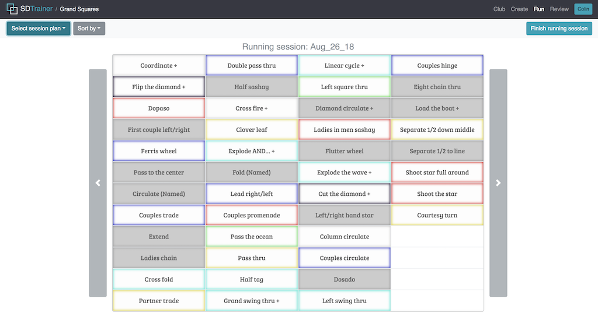
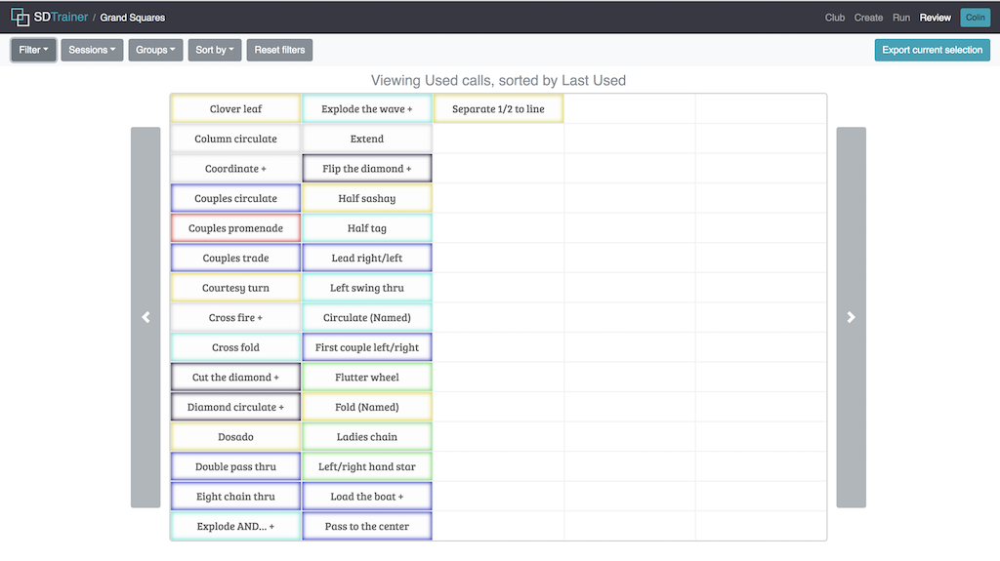
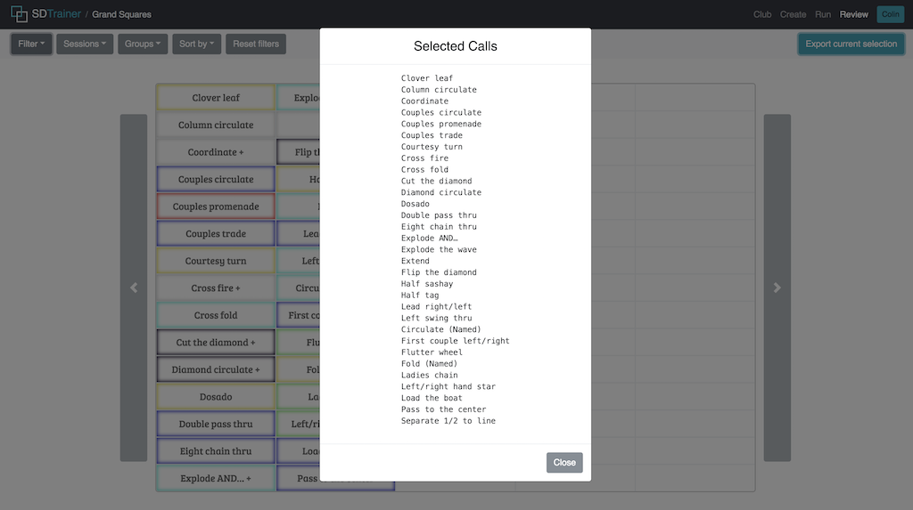

## SDTrainer

Welcome to SDTrainer, an app to assist in teaching square dancing calls to new clubs. It provides tools for tracking multiple clubs' progress over time as well as planning and running individual sessions.

The production build can be found at https://sdtrainer.netlify.com/

## Motivation
Square dancing is a niche sport, and calling (the process of running a square) is even more particular. While some aspects of calling have software, such as managing music and planning sequences of calls for dances, many other parts have nothing, including the lengthy process of teaching clubs the large set of calls they need to memorize to take part in formal dances.

This project was motivated by the lack of relevant software to assist callers in teaching clubs, as it was a great opportunity to develop familiarity with ReactJS while also creating an app that would be actually used in practice. SDTrainer is free to use for any caller, as most callers don't get paid to teach or run dances. They provide their service for free, so this service is provided to them for free.

## Features
Manage mutiple clubs simultaneously and create templates for sessions that can be used by all clubs



Track club progress as well as managing session plans and finished sessions



Create session plans and templates, with tools like drag and drop, filtering calls, and adding previous sessions and templates



Run a session to record which calls were actually taught out of the planned calls



View sessions, groups, or subsets of all calls like used, new, or plus (more difficult) calls



Export lists of any of the sets of calls from the review page to easily email homework or progress summaries to clubs




## Installation
You’ll need to have Node >= 6 on your local development machine.
To run on your local machine, clone the repo and then run:
```
npm install
npm start
```

## Credit
This project was bootstrapped with [Create React App](https://github.com/facebookincubator/create-react-app).

This project uses Node.js, ReactJS, and Google Firebase Firestore

## License
MIT